# TomTom UX Library — Documentation Site

High-fidelity documentation prototype spanning the TomTom developer ecosystem — from the UX Library SDK for automotive OEMs to the Routing API, Long Distance EV Routing API, Matrix Routing, and Waypoint Optimisation. Built to explore and demonstrate what great developer docs UX looks like at TomTom: one product, one audience, one clear path to working code.


---

## What's inside

### UX Library SDK

The UX Library gives OEMs a production-ready baseline for every visible layer of the navigation experience — colours, typography, map styles, navigation panels, search, cluster display, AI assistant integration, and vehicle systems — all overridable without forking the SDK.

Every page pairs written documentation with live interactive demos — sliders, toggles, and configuration builders that generate real Kotlin output — so the integration story is tangible rather than abstract.

Six integration domains:

| Domain | Pages |
|---|---|
| **Design System** | Design tokens, colour, font, corner radius |
| **Map Customisation** | Map style, traffic, safety locations, route styling, map markers |
| **App Customisation** | Home screen layout, search engine, nav controls, horizon panel, NIP, ETA panel, route bar |
| **EV & Charging** | Overview, vehicle & battery, charging search, long-distance routing, in-navigation UI, requirements |
| **Vehicle Integration** | Instrument cluster, head-up display, ADAS integration, truck support |
| **TomTom AI Assistant** | Overview, voice engine, speech-to-text, configuration |

### API Documentation

Standalone documentation products for TomTom's routing and navigation APIs — each built as an independent doc set with its own introduction, quick start, and full API reference. This section demonstrates the principle of audience-first documentation: one guide, one integration track, one path to a working outcome.

| Product | Pages |
|---|---|
| **Routing API** | Introduction, Quick Start (authentication, first route, response structure), Core Concepts (route types, travel modes, vehicle profiles, consumption models), Calculate Route reference, Reachable Range, Batch Routing, Guidance (turn-by-turn, lane guidance), Advanced (reconstruction, avoid areas, tolls), Platform Reference (TomTom Maps v1, Orbis Maps v2, migration guide), API Reference |
| **Long Distance EV Routing API** | Introduction, Quick Start (authentication, first EV route with cURL + Kotlin SDK), Core Concepts (charging stop selection, battery model, connector types), Calculate EV Route reference, Batch EV Route |
| **Matrix Routing v2 API** | Introduction |
| **Waypoint Optimization API** | Introduction |

### Navigation SDK & Automotive Navigation App

Platform-aware introduction pages for the TomTom Navigation SDK and Automotive Navigation Application, with cross-linking between integration tracks.

| Product | Pages |
|---|---|
| **Navigation SDK** | Introduction with platform capabilities, quick start, and integration guidance |
| **Automotive Navigation App** | Introduction with deployment model and customisation overview |

### Key use cases
Eight of the most commonly customised capabilities, each with a visual preview. Click any card to jump directly to that page.


### Explore by domain
Six integration domains with page-pill navigation — each card links directly to its sub-pages.


---

## LDEVR — Introduction

Hero SVG illustration showing the Amsterdam → Paris route with two charging stops (Fastned, Ionity), battery state arcs per segment, dwell times, and a segmented charge bar. Endpoint card links directly to the full reference. Lean layout matching the Routing API intro pattern.

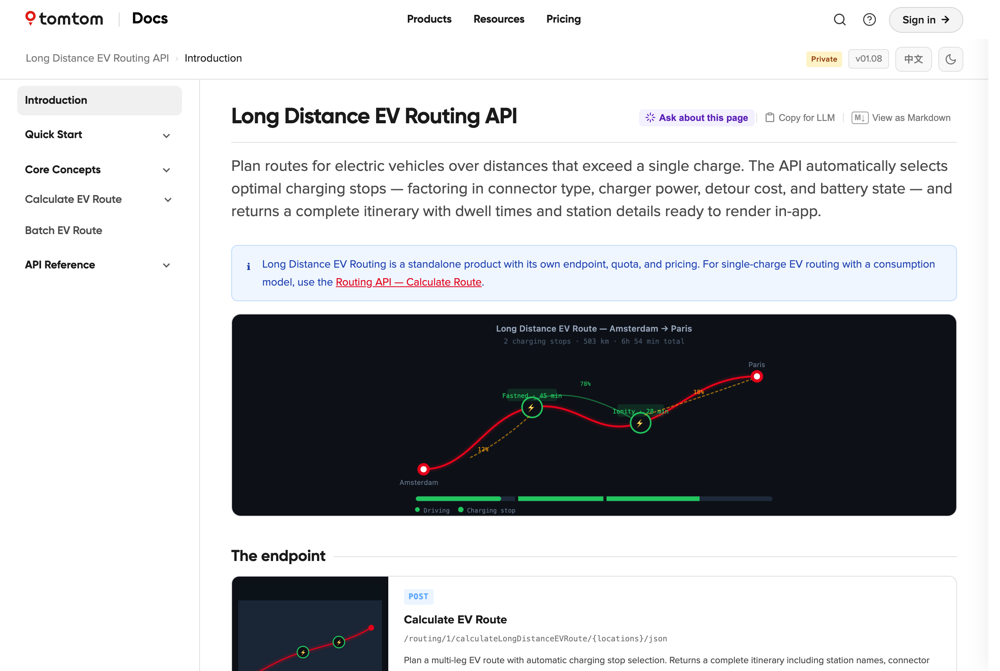

---

### LDEVR — Endpoint card

Single-endpoint showcase card (landscape layout with thumbnail) positioned directly below the hero — the primary entry point to the API reference.

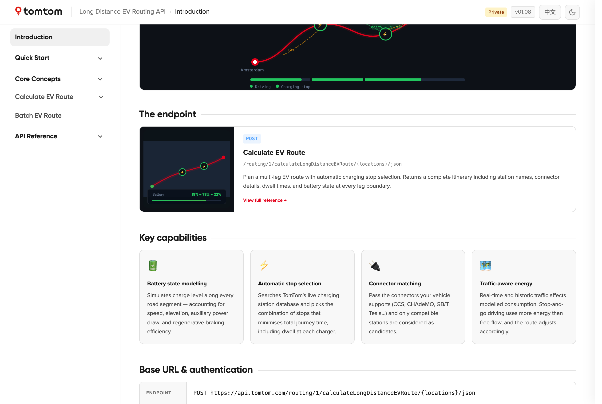

---

### LDEVR — Quick Start

Dedicated quick start page with a working cURL example (Amsterdam → Paris, 75 kWh battery, CCS Combo 2) and full Kotlin SDK integration using `OnlineRoutePlanner`.

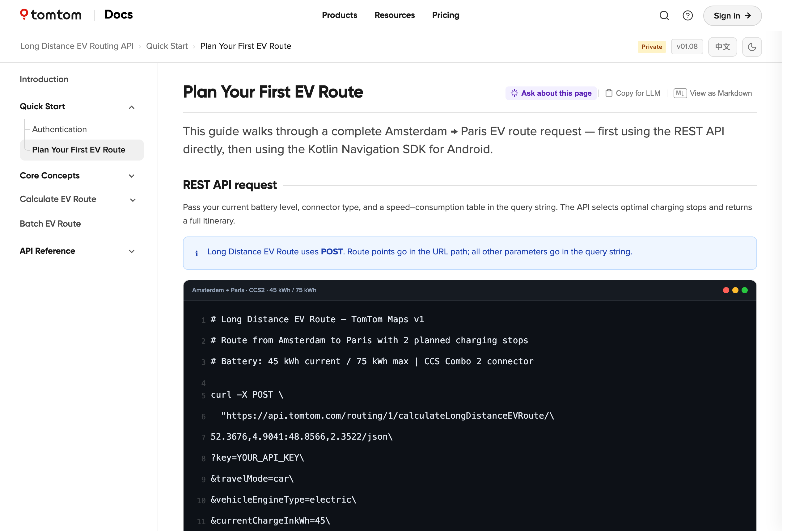

---

### LDEVR — Calculate EV Route reference

Full two-column API reference covering route planning, electric vehicle & battery, charging connector & power, and energy consumption model.

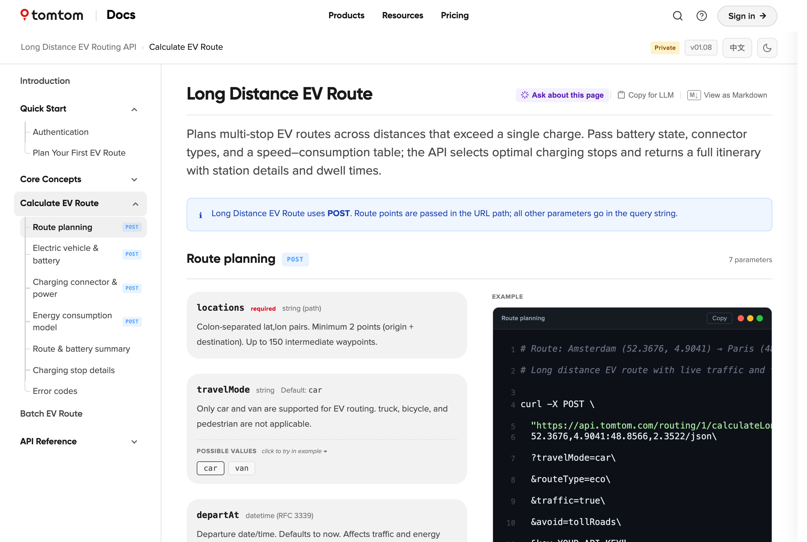

---

### LDEVR — Response section

Route & battery summary response in the two-column layout — parameter table on the left, sticky JSON example on the right.

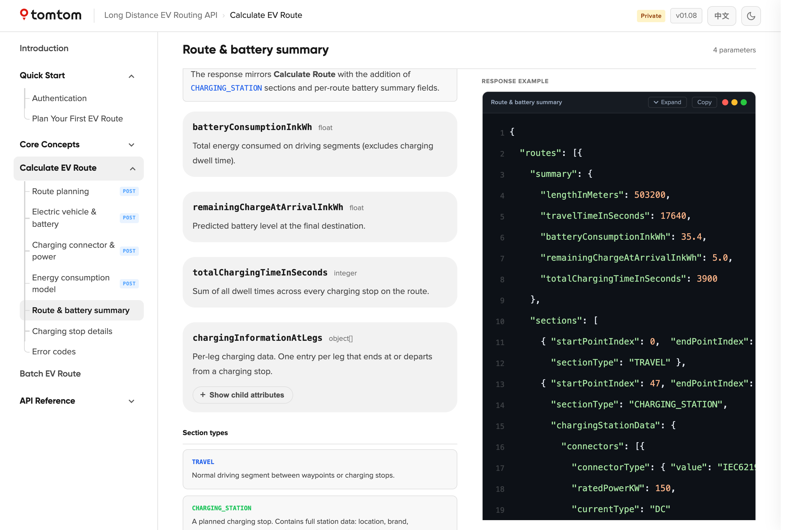

---

### LDEVR — Error codes

Chargetrip-style error cards (HTTP badge + bold title + description) with a matching JSON error response in the code panel.

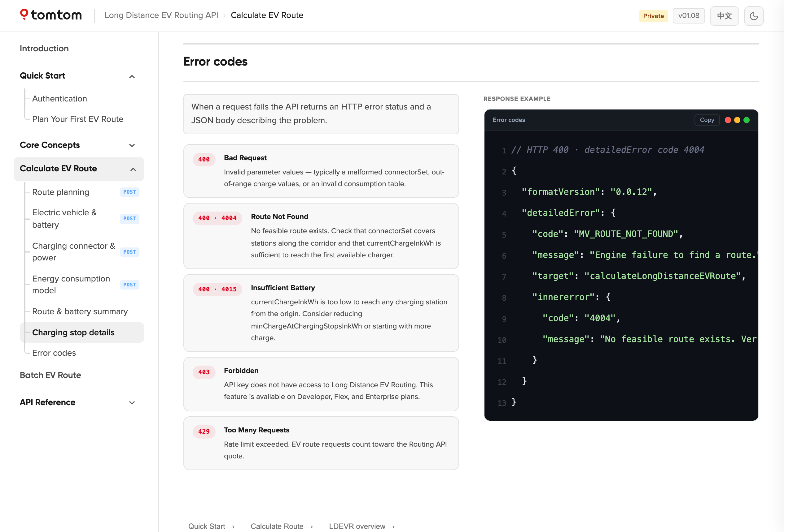

---

## Routing API — Introduction

Hero SVG illustration showing Amsterdam → Brussels fastest route with a traffic jam segment in amber, a dashed alternative route, waypoint B, travel mode chips, and a route summary card. Platform toggle switches between TomTom Maps v1 and Orbis Maps v2.

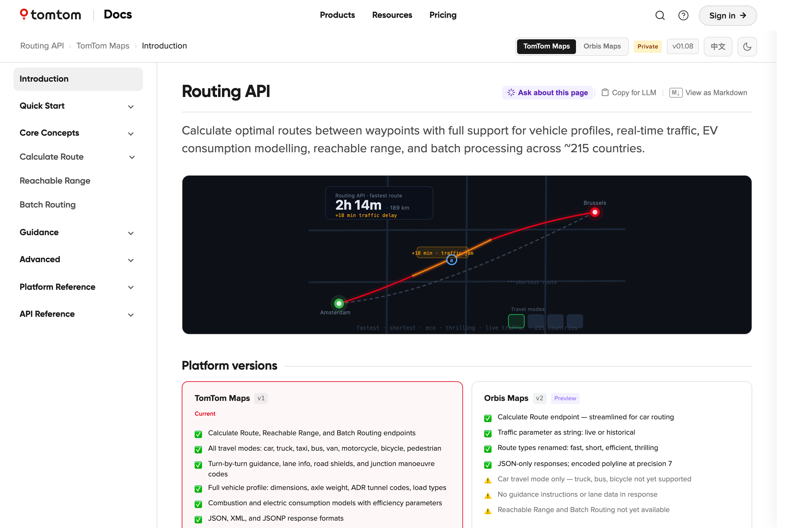

---

### Routing API — Endpoint grid

Three endpoint cards (Calculate Route, Reachable Range, Batch Routing) with visual thumbnails. Platform-aware: cards dim on features unavailable in Orbis v2.

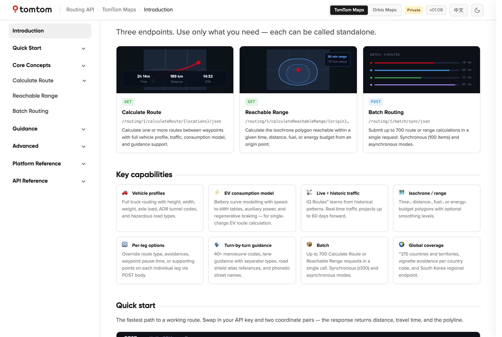

---

### Routing API — Calculate Route reference

Full two-column reference for `GET /routing/1/calculateRoute` — 15 route planning parameters, vehicle profile, combustion + electric consumption models, POST body, response summary, and error codes.

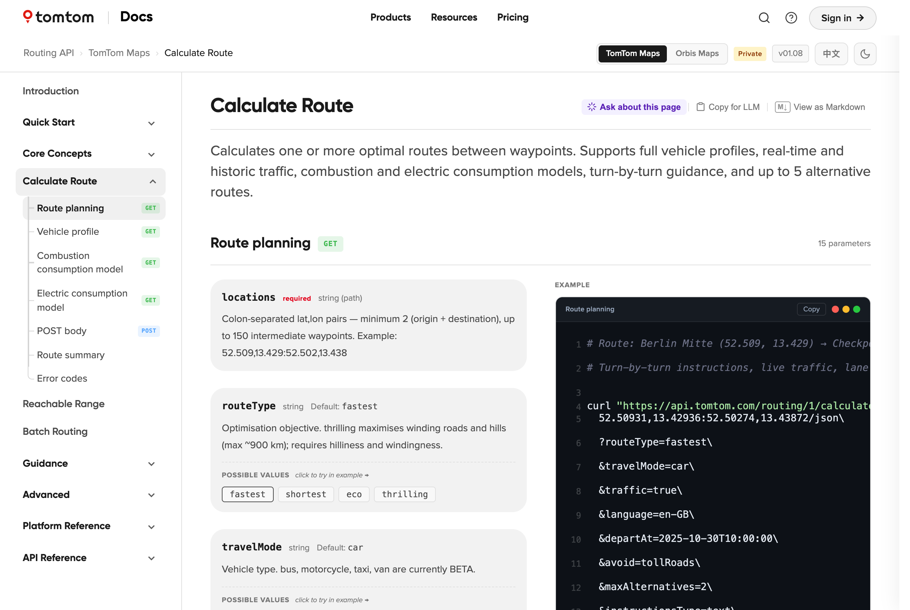

---

### Two-column API reference layout — parameters

Sticky code panel stays in view as parameters scroll. Method badges (GET / POST) on sidenav anchors. Possible values shown as clickable chips.

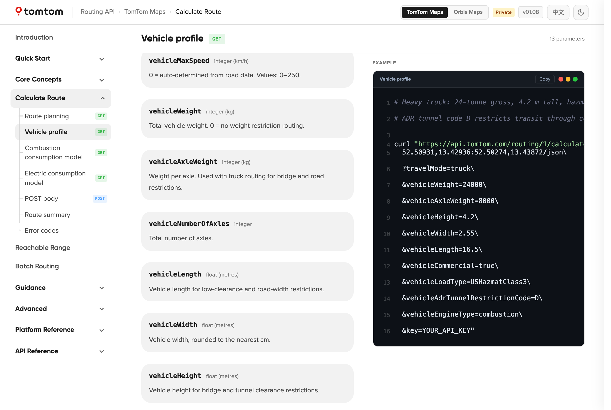

---

### Routing API — Error codes

Five error cards with response codes, titles, and descriptions. Matching JSON error response in the right-hand panel.

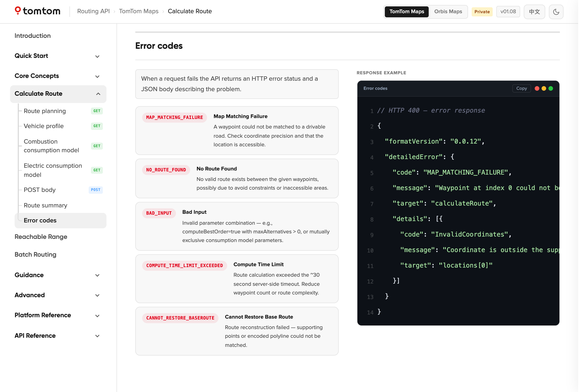

---

### Expand / collapse code panel

Long code blocks detect overflow automatically and show a bottom fade gradient hint. The Expand button breaks the panel out of its sticky container to show the full response inline.

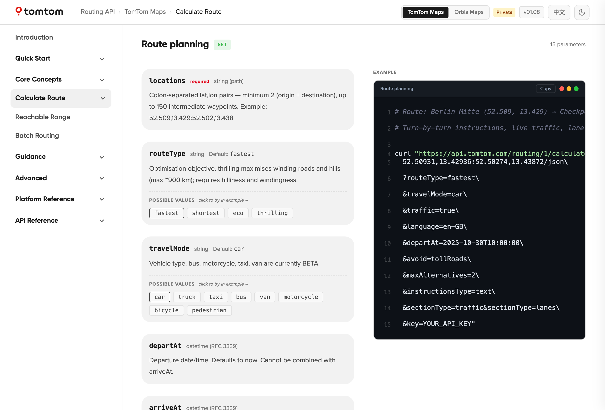

---

## DocsPortal

A replica of the `docs.tomtom.com` navigation shell, accessible from the Products link in the top nav. Demonstrates how the individual product doc sets would sit inside TomTom's real developer portal — with the left-hand product picker, breadcrumb, and page structure matching the live site.

---

## Ask AI integration

Every page surfaces an **Ask about this page** button that opens a contextual AI chat panel from the right. Opening the panel pushes the layout: the sidenav and TOC slide away, the content expands to fill the full width, and the header bars shrink to match — so the page remains fully readable and interactive while the conversation is open.

The panel seeds itself from the current page's content so responses are immediately relevant to what the developer is looking at.


*Above: panel open on the EV Charging Search page. The user asks how to surface only preferred EMSP network partners — the AI responds with the `preferredNetworks` array in `EVSearchOptions`, connector type filtering, and minimum power thresholds.*


The panel is prototype-ready — swap in a real AI endpoint in `src/components/ui/AskAIPanel.jsx`. The page text is already extracted and structured as context on every open. A suggested integration pattern:

```js
// In AskAIPanel.jsx — replace the DEMO_RESPONSES simulation with:
const response = await fetch('/api/ask', {
  method: 'POST',
  body: JSON.stringify({
    system: `You are a helpful assistant for the TomTom UX Library docs. 
             Answer questions about the following page:\n\n${getPageText()}`,
    message: userMessage,
  }),
});
```

---

## Chinese localisation (中文)

All core pages are available in Simplified Chinese. Toggle between EN and 中文 using the language switcher in the top-right corner — the full navigation, page titles, body content, and UI labels switch instantly.


Translations live in `src/locales/zh/` and are wired through `react-i18next`. Adding a new language requires only a matching locale folder — no component changes needed.

---

## Screens

### Map Style — live interactive preview
Switch between Browse, Drive, Mono, and Satellite styles. The live TomTom map updates instantly inside a landscape tablet frame with contextual overlays (NIP strip for Drive, search bar for Browse).


---

### Instrument Cluster — interactive configuration builder
Toggle map, horizon panel, and vignette on/off. Add or remove NIP, SLG, CMP, JV, UEP, and ETA components. Switch NIP and ETA layout types. The cluster display updates live and generates the corresponding Kotlin + ADB intent code.


---

### TomTom AI Assistant — architecture overview
The signal flow from driver voice input through OEM STT, VPA Cloud, TAIA SDK, and TAIA Cloud — down to the Navigation App and TTS output — shown as a layered stack with OEM vs TomTom ownership badges.


---

### ADAS Integration — capabilities & integration model
Highlights the six ADAS SDK capabilities (ISA, Predictive Speed Control, Safety Alerts, Lane Control, EV Energy Optimisation, ODD) alongside a stack diagram showing how the SDK layers onto any existing navigation provider.


---

### Dark mode
Full dark theme across all pages — map previews, cluster display, navigation panels, code blocks, and the global header.


---

### Home Screen Layout — interactive IVI screen zones & resize demo
Click any of the four named zones to highlight it on the full-width IVI mock. Drag the four inset sliders to resize the navigation application area live — the generated Kotlin code updates in real time. A fourth explorer lets you combine all four UI state dimensions to inspect active/passive transitions.


---

### Navigation Controls — button bar position & search entry point
Choose from four button bar positions (left, right, top, bottom) and toggle individual control buttons on/off. Switch search entry between a persistent destination panel and a compact button. The full-width IVI mock and Kotlin snippet update instantly.


---

### Horizon Panel — composed vs decomposed layout
Toggle between the single composed Horizon Panel and its three independent sub-components (NIP, Upcoming Events, ETA). Switch panel position between left, centre, and right. The full-width guidance mock shows exactly how each configuration looks on screen.


---

### Next Instruction Panel — five anchor positions
Place the NIP at any of five anchor points (top-left, top-centre, top-right, bottom-left, bottom-right). The full-width map mock and Kotlin configuration update live.


---

### ETA Panel — position & content field toggles
Choose from six anchor positions and individually show/hide each content field (ETA, travel time, distance, battery SoC, end-route button) via toggle switches. The full-width map mock and generated Kotlin reflect every change.


---

### EV & Charging — domain landing
The full EV integration journey in one view — battery modelling, charging search, long-distance routing, and in-navigation SoC UI. Each sub-page is one click from the landing card grid.


---

### EV Long-Distance Routing — Berlin → Amsterdam trip timeline
A real-world 679 km route showing LDEVR automatically inserting two charging stops (Ionity Bochum + Fastned Eindhoven) with per-stop SoC, kWh, peak power, and charge time. Zero routing code required from the OEM.


---

## Running locally

Everything runs in the browser — no backend, no environment variables needed.

### Prerequisites

| Tool | Version | Install |
|---|---|---|
| **Node.js** | 18 or higher | [nodejs.org](https://nodejs.org) — download the LTS installer |
| **Git** | any | [git-scm.com](https://git-scm.com) — or use GitHub Desktop |

To check if you already have them, open a terminal and run:

```bash
node -v   # should print v18.x or higher
git --version
```

### Steps

**1. Clone the repository**

```bash
git clone https://github.com/PremalMistry-TomTom/ux-library-docs.git
```

**2. Move into the project folder**

```bash
cd ux-library-docs/ux-library
```

**3. Install dependencies** *(first time only, takes ~30 seconds)*

```bash
npm install
```

**4. Start the dev server**

```bash
npm run dev
```

**5. Open in your browser**

```
http://localhost:5173
```

The site loads instantly. Any changes you save to the source files hot-reload automatically — no restart needed.

### Stopping the server

Press `Ctrl + C` in the terminal.

### Updating to the latest version

```bash
git pull
npm install   # only needed if dependencies changed
npm run dev
```

---

## Structure

```
src/
├── pages/
│   ├── RoutingAPIIntro.jsx         # Routing API introduction + hero illustration
│   ├── RoutingCalculateRoute.jsx   # Calculate Route — full two-column API reference
│   ├── LDEVRIntro.jsx              # LDEVR introduction + hero illustration
│   ├── LDEVRFirstRoute.jsx         # LDEVR quick start (cURL + Kotlin SDK)
│   ├── RoutingEVRoute.jsx          # Calculate EV Route — full two-column API reference
│   ├── MatrixRoutingIntro.jsx      # Matrix Routing introduction
│   ├── WaypointOptIntro.jsx        # Waypoint Optimisation introduction
│   ├── NavSDKIntro.jsx             # Navigation SDK introduction
│   ├── ANAIntro.jsx                # Automotive Navigation App introduction
│   ├── DocsPortal.jsx              # docs.tomtom.com shell replica
│   └── ...                         # UX Library SDK pages (EV, Cluster, Map, TAIA…)
├── components/
│   ├── layout/     # Topnav, Sidenav, TOC, GlobalHeader
│   └── ui/
│       ├── ApiRefTwoCol.jsx        # Two-column parallax API reference layout
│       ├── Callout.jsx
│       ├── CodeBlock.jsx
│       ├── PageActions.jsx
│       └── ...
├── data/
│   ├── nav-routing-api.js          # Routing API nav + page titles
│   ├── nav-ldevr.js                # LDEVR nav + page titles
│   ├── nav-matrix.js               # Matrix Routing nav
│   ├── nav-waypoint.js             # Waypoint Optimisation nav
│   ├── nav-navsdk.js               # Navigation SDK nav
│   ├── nav-ana.js                  # Automotive Navigation App nav
│   ├── nav-ux-library.js           # UX Library SDK nav
│   └── products.js                 # Top-level product registry
├── hooks/          # useGlobalHeader
├── locales/        # EN + ZH i18n strings
└── index.css       # Design system — 4pt scale, CSS custom properties, dark mode
```

## Tech

- **React + Vite** — SPA, no router (page state in `useState`)
- **react-i18next** — EN / 中文 localisation
- **TomTom Maps Web SDK** — live map on Map Style and Tilt pages
- **CSS custom properties** — theming, spacing scale, dark mode via `data-theme`
- **GitHub Actions** — builds and deploys to GitHub Pages on push to `main`
