# TomTom UX Library — Documentation Site

Interactive documentation for the TomTom UX Library SDK — a composable Android UI layer built on top of NavSDK for automotive, IVI, and fleet navigation applications.

This site is built as a high-fidelity prototype to communicate the SDK's capabilities to OEM partners and internal stakeholders. Every page pairs written documentation with live interactive demos — sliders, toggles, and configuration builders that generate real Kotlin output — so the integration story is tangible rather than abstract. Pages are organised across six integration domains, each with its own landing page and sub-pages covering architecture, configuration, API references, and annotated code examples. The site supports full Simplified Chinese localisation, dark mode, and a contextual AI chat panel on every page.

> **Live preview →** deploy via Vercel (see [Sharing internally](#sharing-internally) below)

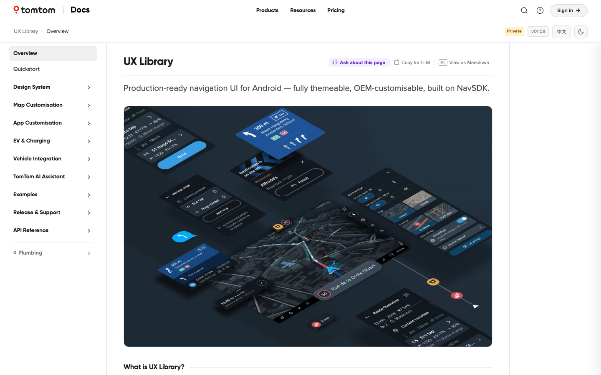

---

## What's inside

The UX Library gives OEMs a production-ready baseline for every visible layer of the navigation experience — colours, typography, map styles, navigation panels, search, cluster display, AI assistant integration, and vehicle systems — all overridable without forking the SDK.

Six integration domains:

| Domain | Pages |
|---|---|
| **Design System** | Design tokens, colour, font, corner radius |
| **Map Customisation** | Map style, traffic, safety locations, route styling, map markers |
| **App Customisation** | Home screen layout, search engine, nav controls, horizon panel, NIP, ETA panel, route bar |
| **EV & Charging** | Overview, vehicle & battery, charging search, long-distance routing, in-navigation UI, requirements |
| **Vehicle Integration** | Instrument cluster, head-up display, ADAS integration, truck support |
| **TomTom AI Assistant** | Overview, voice engine, speech-to-text, configuration |

### Key use cases
Eight of the most commonly customised capabilities, each with a visual preview. Click any card to jump directly to that page.

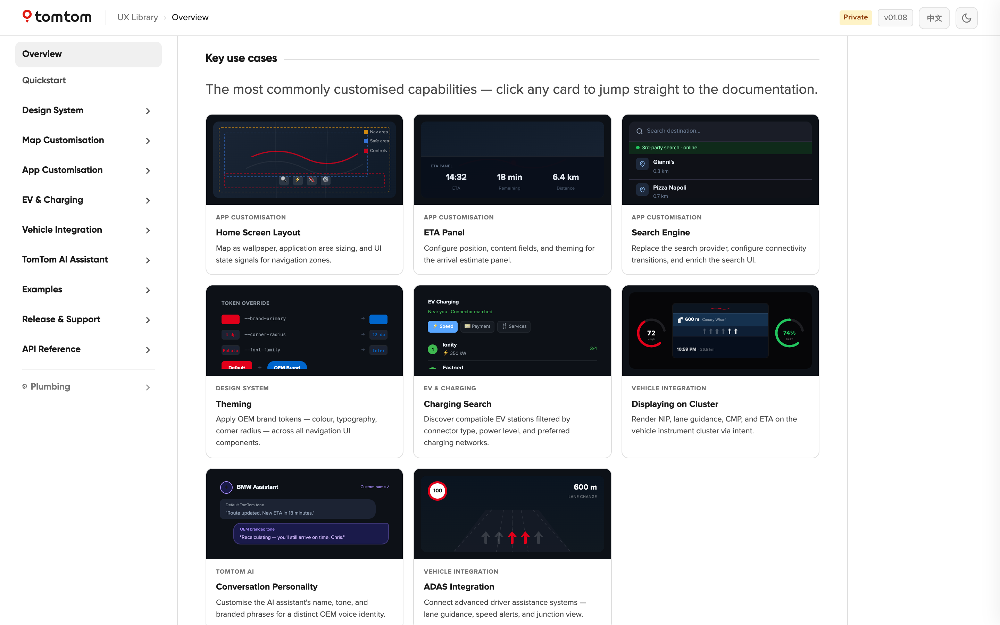

### Explore by domain
Six integration domains with page-pill navigation — each card links directly to its sub-pages.

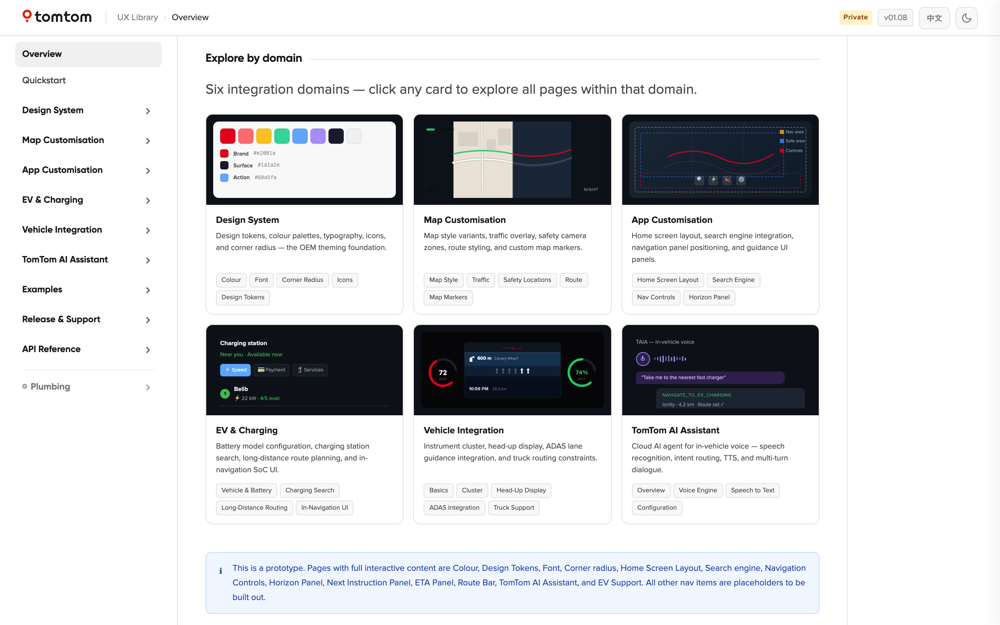

---

## Ask AI integration

Every page surfaces an **Ask about this page** button that opens a contextual AI chat panel from the right. Opening the panel pushes the layout: the sidenav and TOC slide away, the content expands to fill the full width, and the header bars shrink to match — so the page remains fully readable and interactive while the conversation is open.

The panel seeds itself from the current page's content so responses are immediately relevant to what the developer is looking at.

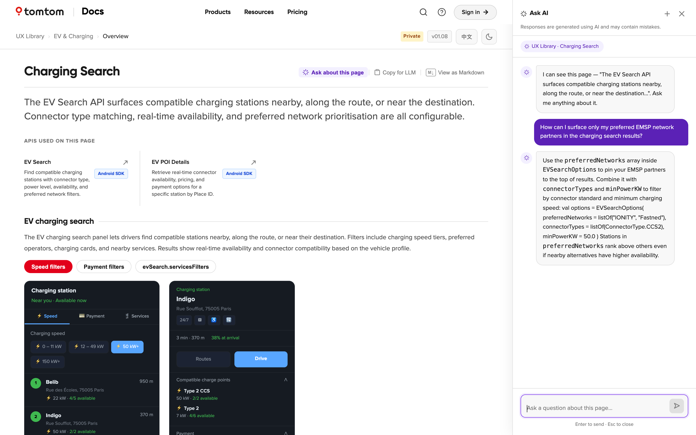

*Above: panel open on the EV Charging Search page. The user asks how to surface only preferred EMSP network partners — the AI responds with the `preferredNetworks` array in `EVSearchOptions`, connector type filtering, and minimum power thresholds.*

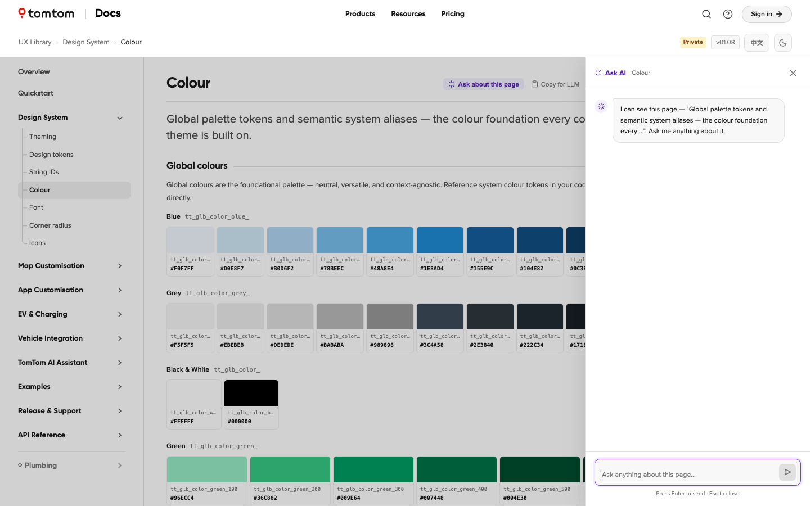

The panel is prototype-ready — swap in a real AI endpoint in `src/components/ui/AskAIPanel.jsx`. The page text is already extracted and structured as context on every open. A suggested integration pattern:

```js
// In AskAIPanel.jsx — replace the DEMO_RESPONSES simulation with:
const response = await fetch('/api/ask', {
  method: 'POST',
  body: JSON.stringify({
    system: `You are a helpful assistant for the TomTom UX Library docs. 
             Answer questions about the following page:\n\n${getPageText()}`,
    message: userMessage,
  }),
});
```

---

## Chinese localisation (中文)

All core pages are available in Simplified Chinese. Toggle between EN and 中文 using the language switcher in the top-right corner — the full navigation, page titles, body content, and UI labels switch instantly.

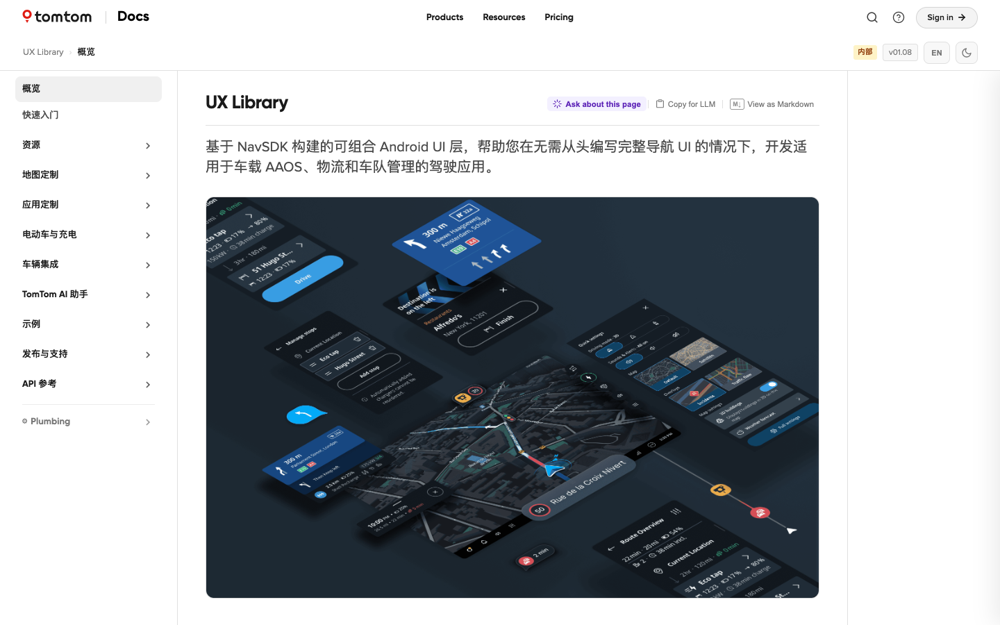

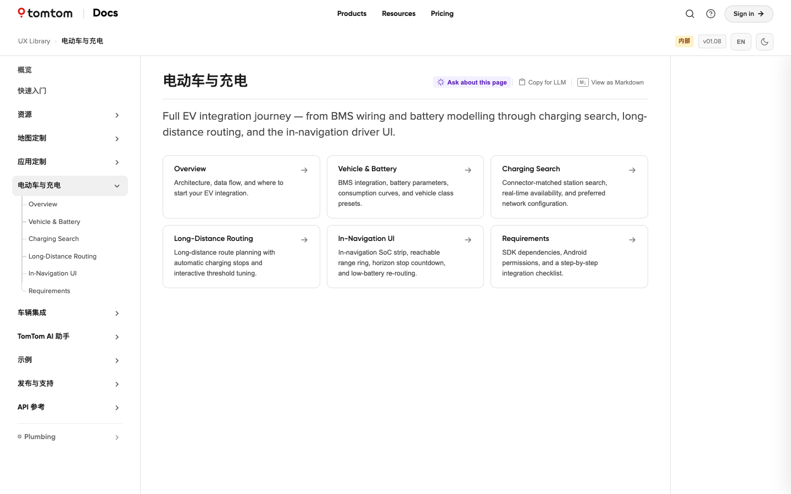

Translations live in `src/locales/zh/` and are wired through `react-i18next`. Adding a new language requires only a matching locale folder — no component changes needed.

---

## Screens

### Map Style — live interactive preview
Switch between Browse, Drive, Mono, and Satellite styles. The live TomTom map updates instantly inside a landscape tablet frame with contextual overlays (NIP strip for Drive, search bar for Browse).

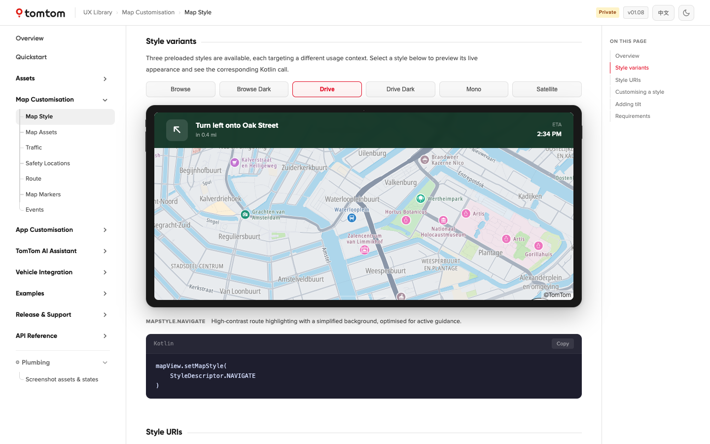

---

### Instrument Cluster — interactive configuration builder
Toggle map, horizon panel, and vignette on/off. Add or remove NIP, SLG, CMP, JV, UEP, and ETA components. Switch NIP and ETA layout types. The cluster display updates live and generates the corresponding Kotlin + ADB intent code.

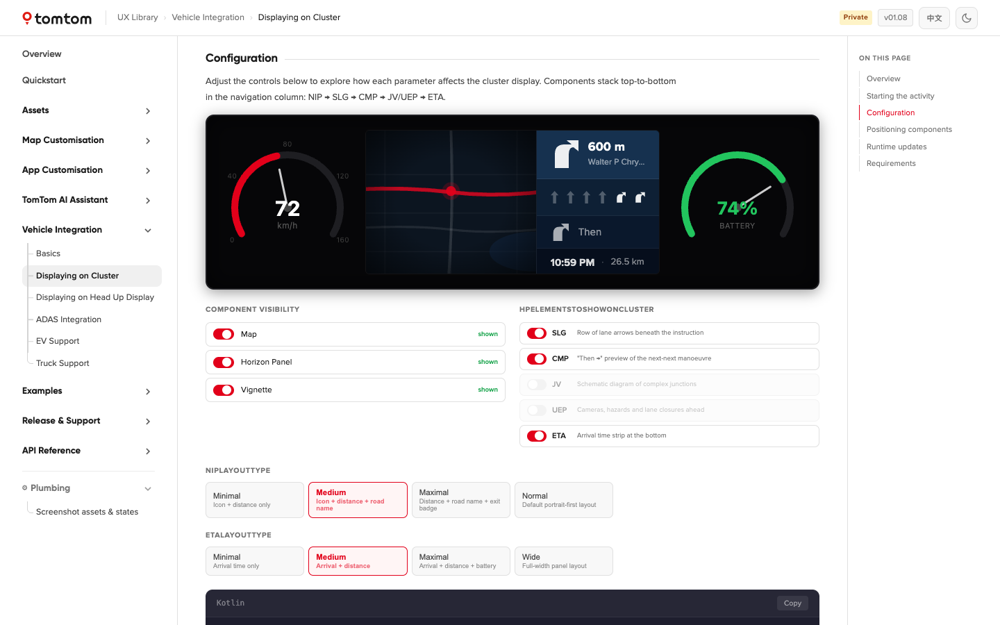

---

### TomTom AI Assistant — architecture overview
The signal flow from driver voice input through OEM STT, VPA Cloud, TAIA SDK, and TAIA Cloud — down to the Navigation App and TTS output — shown as a layered stack with OEM vs TomTom ownership badges.

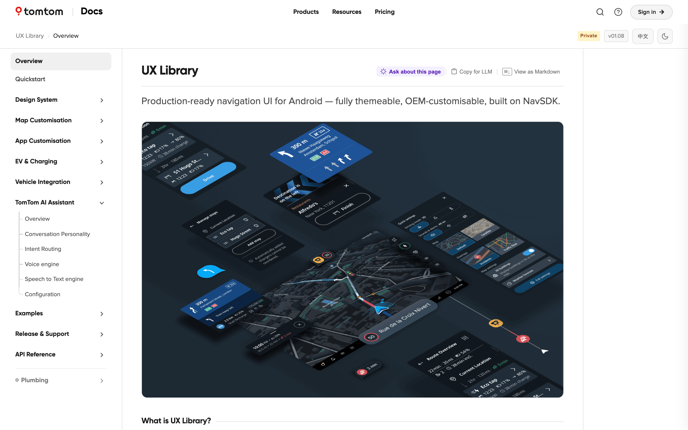

---

### ADAS Integration — capabilities & integration model
Highlights the six ADAS SDK capabilities (ISA, Predictive Speed Control, Safety Alerts, Lane Control, EV Energy Optimisation, ODD) alongside a stack diagram showing how the SDK layers onto any existing navigation provider.

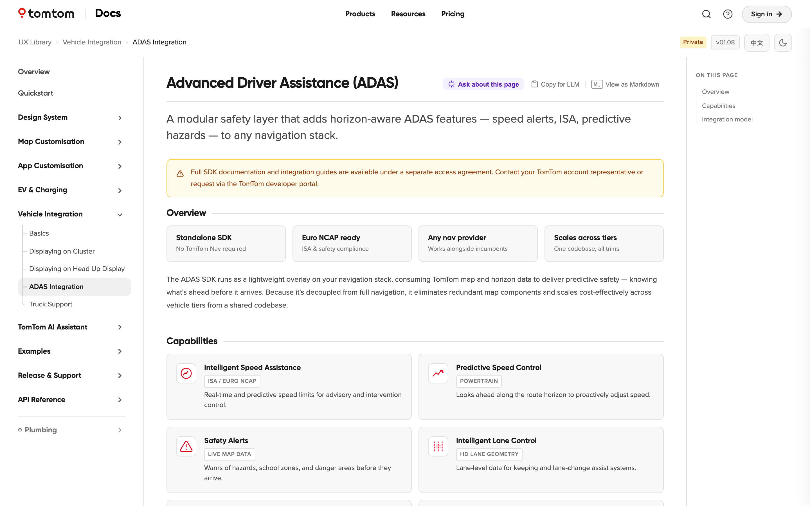

---

### Dark mode
Full dark theme across all pages — map previews, cluster display, navigation panels, code blocks, and the global header.

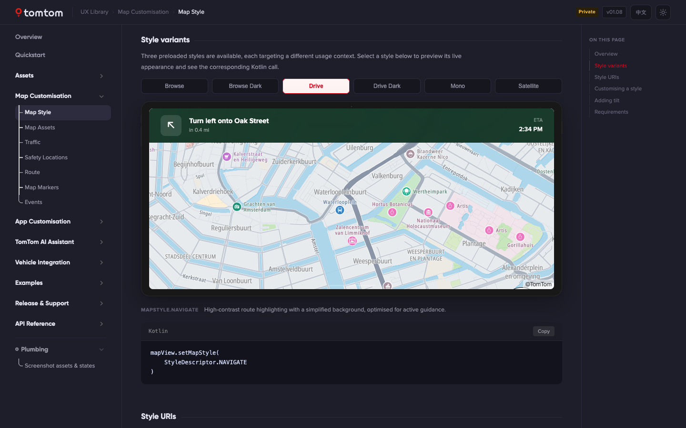

---

### Home Screen Layout — interactive IVI screen zones & resize demo
Click any of the four named zones to highlight it on the full-width IVI mock. Drag the four inset sliders to resize the navigation application area live — the generated Kotlin code updates in real time. A fourth explorer lets you combine all four UI state dimensions to inspect active/passive transitions.

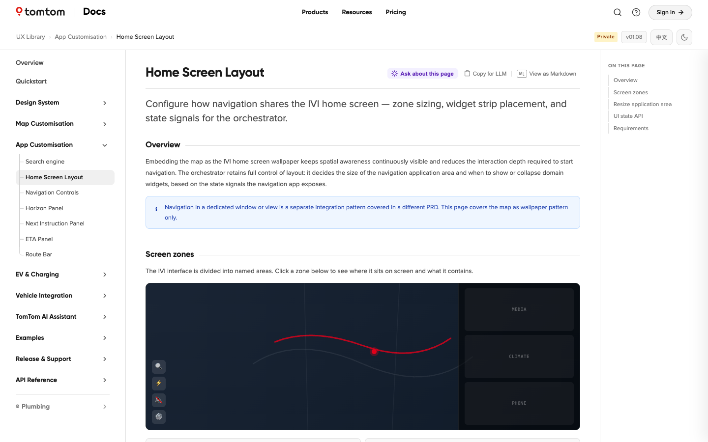

---

### Navigation Controls — button bar position & search entry point
Choose from four button bar positions (left, right, top, bottom) and toggle individual control buttons on/off. Switch search entry between a persistent destination panel and a compact button. The full-width IVI mock and Kotlin snippet update instantly.

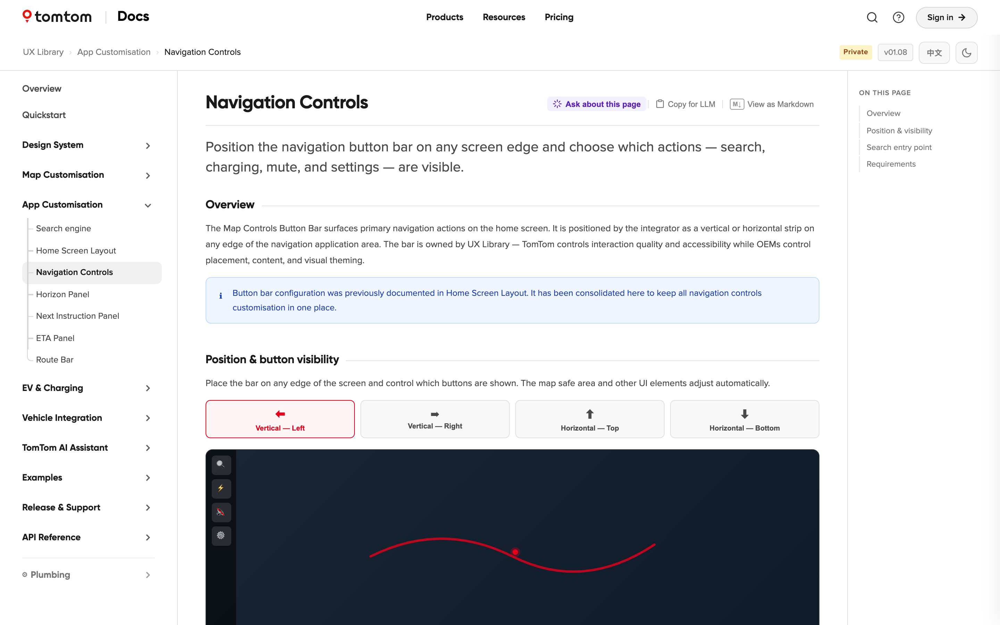

---

### Horizon Panel — composed vs decomposed layout
Toggle between the single composed Horizon Panel and its three independent sub-components (NIP, Upcoming Events, ETA). Switch panel position between left, centre, and right. The full-width guidance mock shows exactly how each configuration looks on screen.

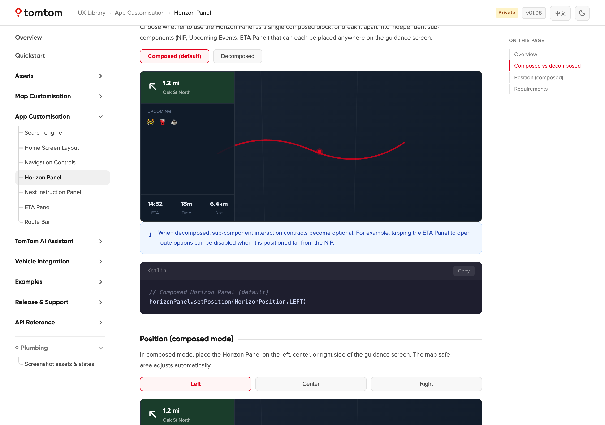

---

### Next Instruction Panel — five anchor positions
Place the NIP at any of five anchor points (top-left, top-centre, top-right, bottom-left, bottom-right). The full-width map mock and Kotlin configuration update live.

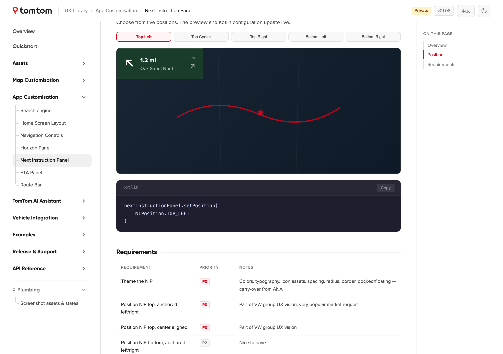

---

### ETA Panel — position & content field toggles
Choose from six anchor positions and individually show/hide each content field (ETA, travel time, distance, battery SoC, end-route button) via toggle switches. The full-width map mock and generated Kotlin reflect every change.

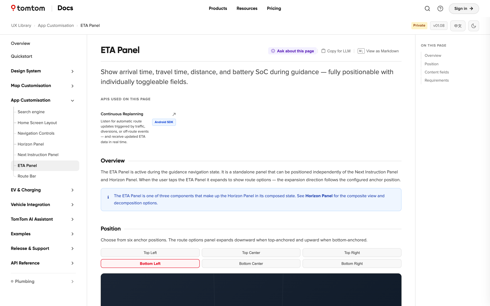

---

### EV & Charging — domain landing
The full EV integration journey in one view — battery modelling, charging search, long-distance routing, and in-navigation SoC UI. Each sub-page is one click from the landing card grid.


---

### EV Long-Distance Routing — Berlin → Amsterdam trip timeline
A real-world 679 km route showing LDEVR automatically inserting two charging stops (Ionity Bochum + Fastned Eindhoven) with per-stop SoC, kWh, peak power, and charge time. Zero routing code required from the OEM.

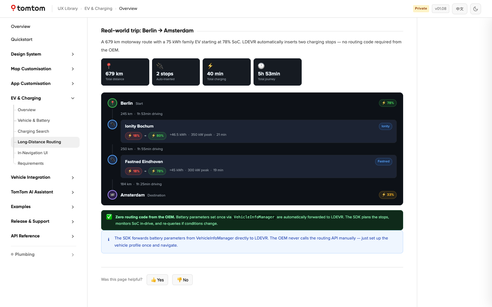

---

## Running locally

Everything runs in the browser — no backend, no environment variables needed.

### Prerequisites

| Tool | Version | Install |
|---|---|---|
| **Node.js** | 18 or higher | [nodejs.org](https://nodejs.org) — download the LTS installer |
| **Git** | any | [git-scm.com](https://git-scm.com) — or use GitHub Desktop |

To check if you already have them, open a terminal and run:

```bash
node -v   # should print v18.x or higher
git --version
```

### Steps

**1. Clone the repository**

```bash
git clone https://github.com/PremalMistry-TomTom/ux-library-docs.git
```

**2. Move into the project folder**

```bash
cd ux-library-docs/ux-library
```

**3. Install dependencies** *(first time only, takes ~30 seconds)*

```bash
npm install
```

**4. Start the dev server**

```bash
npm run dev
```

**5. Open in your browser**

```
http://localhost:5173
```

The site loads instantly. Any changes you save to the source files hot-reload automatically — no restart needed.

### Stopping the server

Press `Ctrl + C` in the terminal.

### Updating to the latest version

```bash
git pull
npm install   # only needed if dependencies changed
npm run dev
```

---

## Structure

```
src/
├── pages/          # One file per doc page
├── components/
│   ├── layout/     # Topnav, Sidenav, TOC, GlobalHeader
│   └── ui/         # Callout, CodeBlock, ApiLinks, Swatch
├── data/           # navigation.js — single source of truth for nav + page titles
├── hooks/          # useGlobalHeader
├── locales/        # EN + ZH i18n strings
└── index.css       # Design system — 4pt scale, CSS custom properties, dark mode
```

## Tech

- **React + Vite** — SPA, no router (page state in `useState`)
- **react-i18next** — EN / 中文 localisation
- **TomTom Maps Web SDK** — live map on Map Style and Tilt pages
- **CSS custom properties** — theming, spacing scale, dark mode via `data-theme`
- **GitHub Actions** — builds and deploys to GitHub Pages on push to `main`
