# TomTom Developer Docs — Portfolio Prototype

A high-fidelity prototype exploring what world-class developer documentation looks like across the entire TomTom product portfolio. Built to answer a single question: *how should TomTom's developer portal work when it serves both SDK integrators and REST API consumers in one unified experience?*

The prototype covers 15 products across two distinct documentation patterns — SDK integration guides and REST API references — and demonstrates the full journey from product discovery to working code.

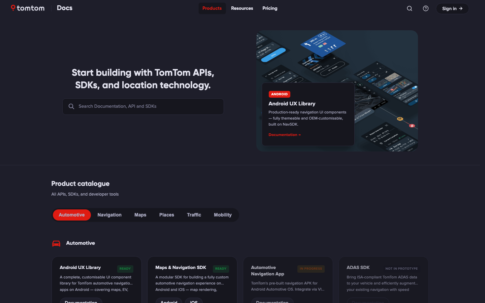

---

## Two documentation patterns

The core design thesis is that TomTom's products split cleanly into two developer audiences with different needs. The prototype builds a full template for each.

### Pattern 1 — SDK & Product Docs

For developers integrating a native SDK into a vehicle or application. The integration story is layered, visual, and configuration-heavy. Documentation must go beyond describing an API surface — it has to show what the output looks like and generate usable code on the spot.

**Products built to this pattern:**

| Product | What's demonstrated |
|---|---|
| **UX Library** | Design system docs — tokens, colour, typography, theming, corner radius. Six integration domains: Map Customisation, App Customisation, EV & Charging, Vehicle Integration, TomTom AI Assistant, and Design System. Every page pairs written docs with live interactive demos that generate real Kotlin output. |
| **Maps & Navigation SDK** | SDK overview with platform capability cards. Eight domain landing pages (Map, Navigation, Routing, Location, Horizon, Advanced, Offline, Search). Full Android + iOS platform parity with a toggle that switches the entire doc set. |
| **Automotive Navigation App** | HMI pattern library — Home Screen Layout, Route Bar, Horizon Panel, ETA Panel, HUD, Nav Controls, POI Details, EV Nav UI. Cluster display and ADAS integration with stack diagrams. |

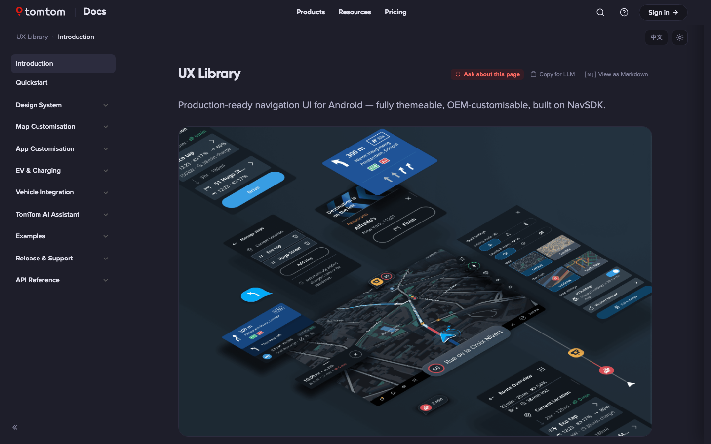

**What makes SDK docs different here:**

- **Interactive configuration builders** — sliders, toggles, and zone editors that produce live Kotlin + ADB intent snippets (Home Screen Layout, Instrument Cluster, Nav Controls, Horizon Panel, ETA Panel, NIP)
- **Live map integration** — the Map Style page renders a real TomTom map with four style variants (Browse, Drive, Mono, Satellite) inside a landscape IVI frame
- **Illustration system** — 40+ theme-aware SVG hero cards used across domain landing pages; dual-style toggle (illustrated vs icon variants); six palette themes with light/dark variants
- **Architecture diagrams** — TomTom AI Assistant signal-flow diagram (OEM STT → VPA Cloud → TAIA SDK → Navigation App → TTS), ADAS SDK capability stack
- **Chinese localisation** — the full UX Library doc set is available in Simplified Chinese; toggle with the language switcher in the top-right corner; wired through `react-i18next`

| | |
|---|---|
| 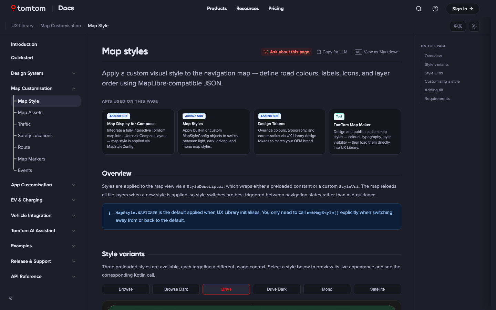 | 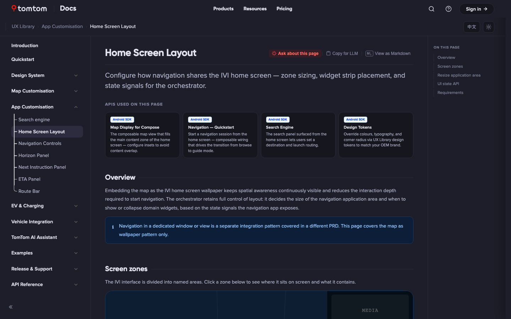 |
| 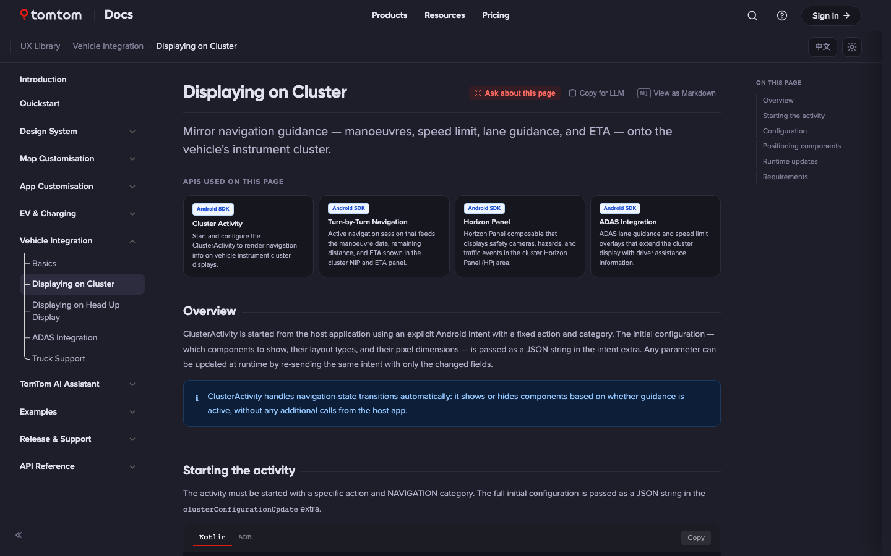 | 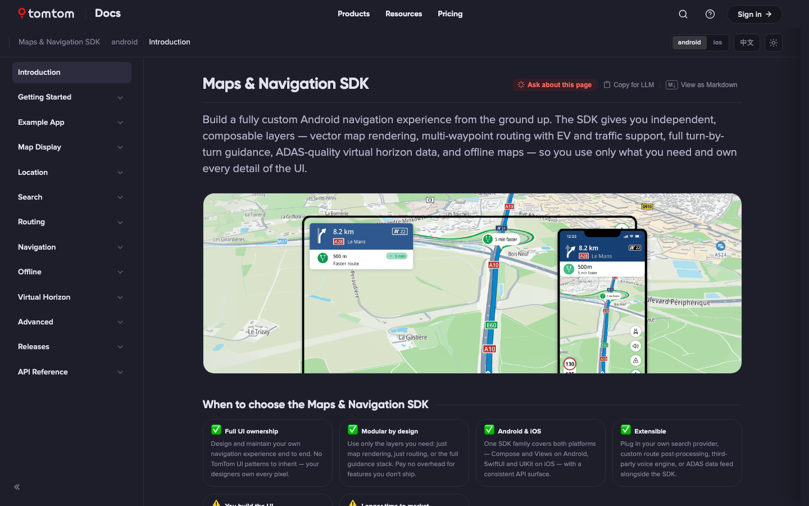 |

---

### Pattern 2 — REST API Docs

For developers calling HTTP endpoints directly. The documentation story is about parameters, response schemas, versioning, and getting to a working request as fast as possible.

**Products built to this pattern:**

| Product | Status | Versions | Endpoint pages |
|---|---|---|---|
| **Routing API** | ✅ Ready | v1 Production · v2 Public Preview · v3 Private Preview | Calculate Route, Reachable Range, Batch Routing, Long Distance EV Route, Matrix Routing v2, Waypoint Optimisation |
| **Traffic API** | ✅ Ready | v1 Production | Flow Segment Data, Raster/Vector Flow Tiles, Incident Details, Raster/Vector Incident Tiles, Traffic Model ID |
| **Map Display API** | ✅ Ready | v1 Production · v2 Public Preview · v3 Private Preview | Raster Tile, Vector Tile, Satellite, Hillshade, Static Image, WMS, WMTS, Map Assets, 3D Landmarks, Extended Tiles, Copyrights |
| **Search API** | ✅ Ready | v1 Production · v2 Public Preview | Fuzzy Search, POI Search, Nearby Search, Along-Route Search, Autocomplete, Batch Search, POI Details, POI Photos |
| **Geocoding API** | ✅ Ready | v1 Production · v2 Public Preview | Geocode, Reverse Geocode, Structured Geocode, Cross-Street Lookup |
| **Long Distance EV Routing** | ✅ Ready | v1 Production · v2 Public Preview · v3 Private Preview | Calculate EV Route, Batch EV Route, Weather, Vehicle Brand, OEM EMSP, Toll, Parks, Guidance |
| **EV Charging API** | ✅ Ready | v1 Production · v3 Private Preview | Station Search, Nearby Search, Along-Route, By ID, Availability, Markets |
| **Traffic Analytics** | 🔄 In Progress | — | Intro + partial |
| **Parking & Fuel API** | 🔄 In Progress | — | Intro + partial |
| **Snap to Roads API** | 🔄 In Progress | — | Intro + partial |

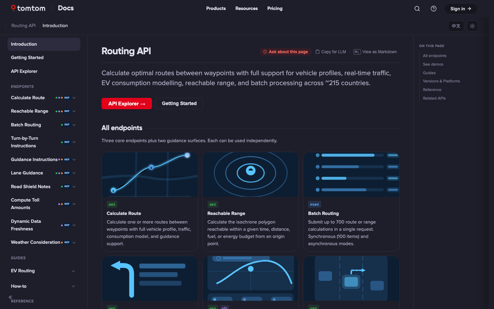

**What makes REST API docs different here:**

- **Concept-first navigation with version coverage dots** — endpoints appear once in the sidenav with coloured dots (●v1 ●v2 ●v3) showing which versions support them. Three nav variants were built: Option A (version-sectioned), Option B (concept-first + vDots, the default), Option C (concept-first + version filter)
- **Two-column API reference layout** — parameter tables scroll on the left; a sticky code panel (request + response) stays anchored on the right. Large responses show a fade-hint and expand in place
- **Getting Started pages** — every API has a quickstart: authentication, first request with cURL, live try-it widget, response field guide, and a version comparison card
- **Version comparison tables** — every intro page has a matrix of features vs versions (v1/v2/v3) so developers know what they can access before reading a single parameter
- **Parameter Index** — A–Z sortable table of every parameter across all endpoint versions with version badges
- **Migration guides** — structured key-changes table (Area · v1 · v2 · Action) with code comparison before/after blocks
- **Market Coverage pages** — Americas / Asia Pacific / Europe / Middle East & Africa tables sourced directly from the devportal documentation repo

| | |
|---|---|
| 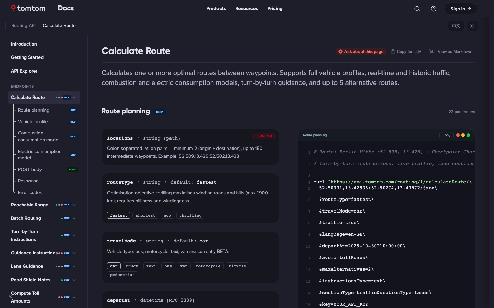 | 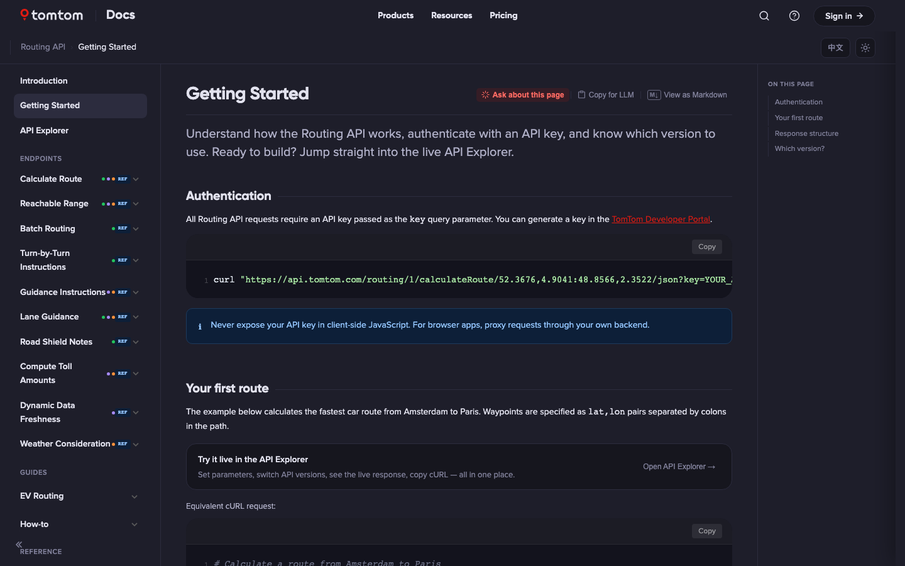 |

---

## Interactive API Explorers

Three fully interactive explorer pages let developers fire real API calls against live TomTom services and see results plotted on a map — no external tool needed.

| Explorer | What it does |
|---|---|
| **Routing Explorer** | Calculate Route and Reachable Range on a live TomTom map. Supports v1 + v2. Origin/destination inputs, travel mode, route type. Route polyline + waypoint markers rendered on the map. |
| **Traffic Explorer** | Incident Details (v5) and Flow Segment Data (v4). Incident request fires on load — markers plotted on map with popup cards, a random incident in viewport auto-opened. Flow segment fires at current map centre with zoom-aware tile calculation. |
| **Map Display Explorer** | Raster Tile (3×3 tile grid centred on a coordinate) and Static Image (live preview, updates on every param change). No SDK needed — tiles load directly as `` elements. |

All explorer pages support the portal's light/dark theme toggle — the TomTom Maps SDK style switches between `basic_street-light` and `basic_street-dark` automatically.

| | |
|---|---|
| 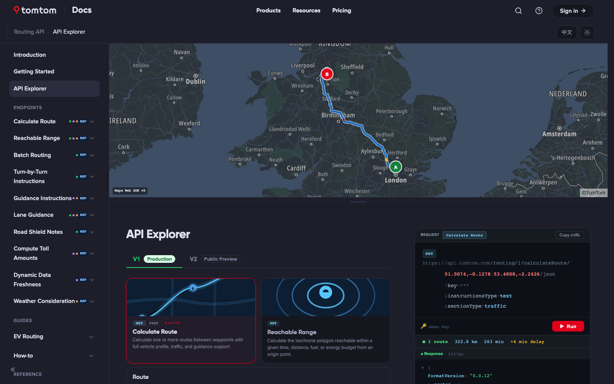 | 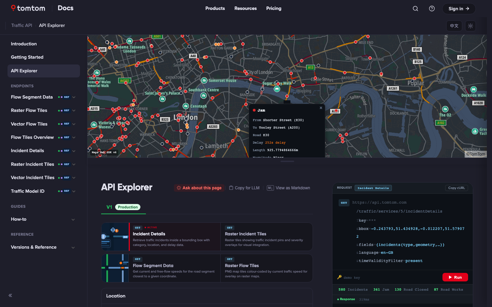 |

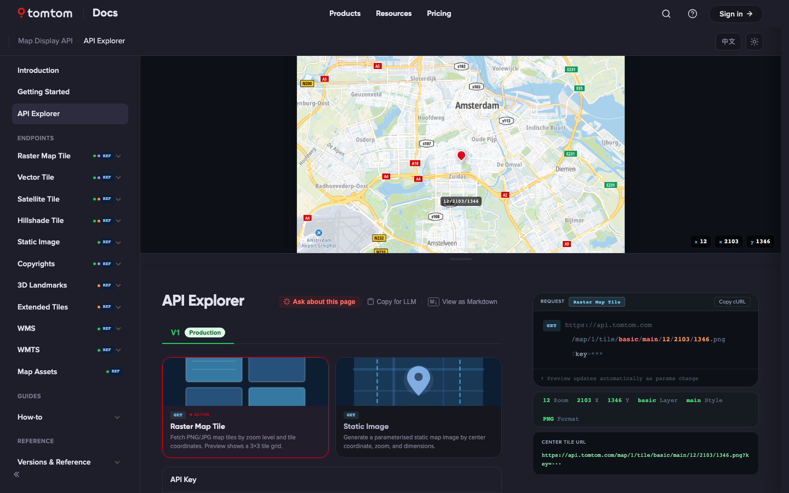

---

## Product Discovery — DocsPortal

The DocsPortal (`/products`) is a replica of the `docs.tomtom.com` navigation shell showing how all products sit together. It demonstrates:

- **Product catalogue** — 15 products with Ready (green) / In Progress (amber) / Not yet built (grey) status
- **Use-case filtering** — six buyer-centric categories (Automotive, Navigation, Maps, Places, Traffic, Mobility) that cross-cut products instead of mirroring the product tree
- **Consistent product cards** — thumbnail illustration, product name, description, status badge, and direct link into the product's documentation

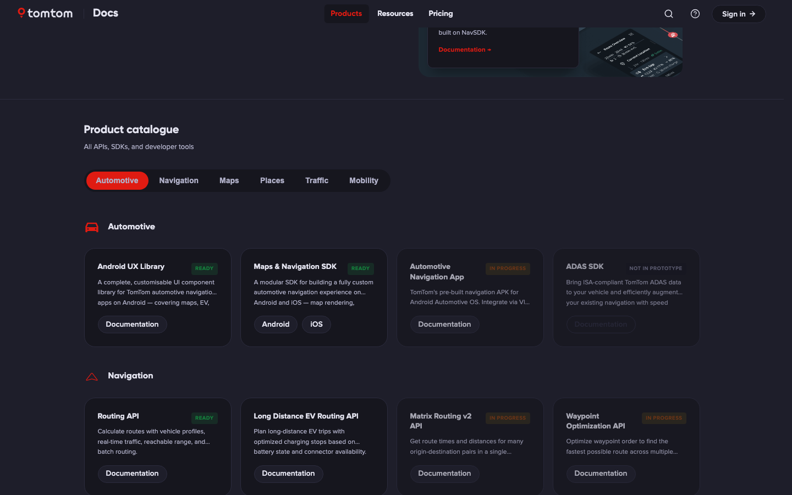

---

## Ask AI

Every page surfaces an **Ask about this page** button (top-right of the page header) that opens a contextual AI chat panel. The panel seeds itself from the current page content so responses are immediately relevant to what the developer is looking at. Opening the panel pushes the layout: sidenav and TOC slide away, content expands to full width.

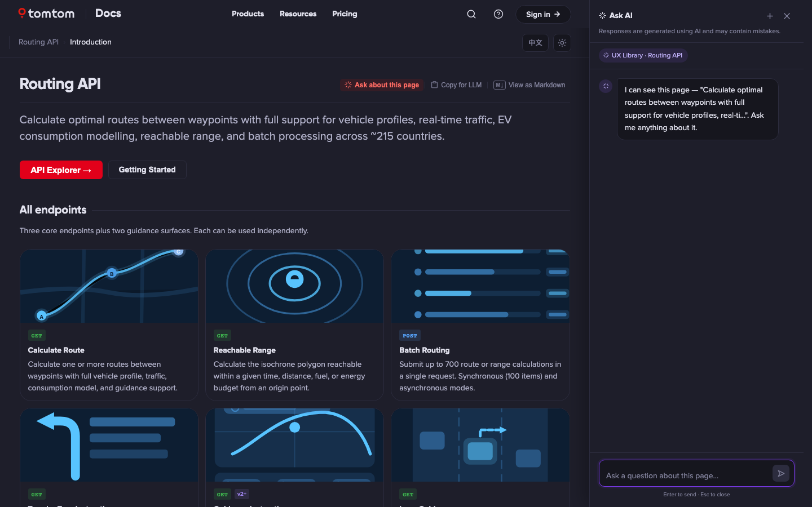

The panel is prototype-ready — swap in a real AI endpoint in `src/components/ui/AskAIPanel.jsx`. Page text is already extracted and structured as context on every open.

---

## Dark mode & Light mode

The portal supports both themes, toggled from the breadcrumb bar. All pages, maps, code blocks, and navigation elements respond to the toggle.

| Dark (default) | Light |
|---|---|
|  | 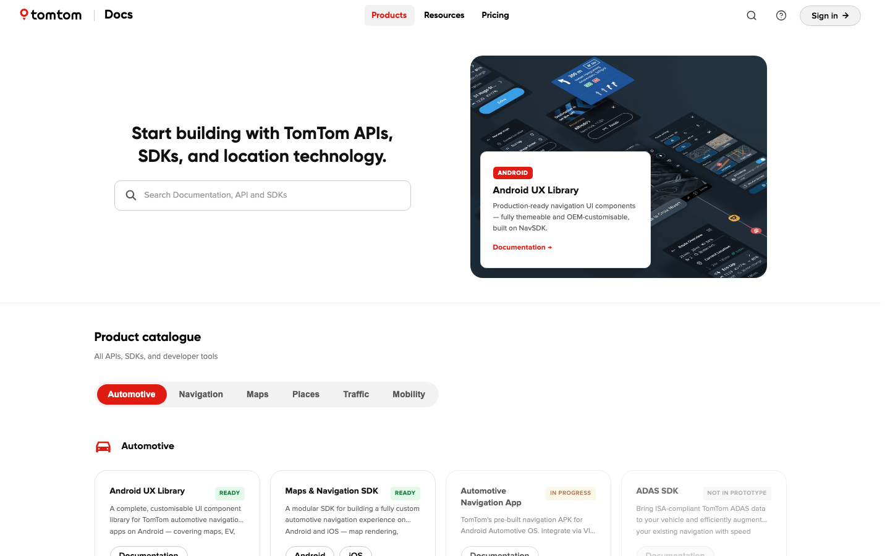 |

---

## Running locally

Everything runs in the browser — no backend, no environment variables needed.

### Prerequisites

| Tool | Version | Install |
|---|---|---|
| **Node.js** | 18 or higher | [nodejs.org](https://nodejs.org) |
| **Git** | any | [git-scm.com](https://git-scm.com) |

```bash
node -v   # should print v18.x or higher
```

### Steps

```bash
# 1. Clone
git clone https://github.com/PremalMistry-TomTom/ux-library-docs.git

# 2. Enter the project
cd ux-library-docs/ux-library

# 3. Install dependencies (first time only, ~30 seconds)
npm install

# 4. Start the dev server
npm run dev
```

Open `http://localhost:5173` — hot-reloads on save, no restart needed.

> **Password:** `FasterRouteFound`

---

## Structure

```
src/
├── pages/
│   │
│   ├── ── SDK & Product pages ──────────────────────────────────────
│   ├── Overview.jsx                  # UX Library hub + domain cards
│   ├── DocsPortal.jsx                # Product discovery + catalogue
│   ├── DomainLanding.jsx             # Generic domain landing (UX Library)
│   ├── NavSDKIntro.jsx               # Maps & Navigation SDK overview
│   ├── NavSDK*.jsx                   # 8 domain pages + iOS parity
│   ├── ANAIntro.jsx                  # Automotive Navigation App overview
│   ├── HomeScreenLayout.jsx          # IVI zone editor + Kotlin output
│   ├── Cluster.jsx                   # Instrument cluster config builder
│   ├── HorizonPanel.jsx, ETAPanel.jsx, InstructionPanel.jsx,
│   │   NavigationControls.jsx, HUD.jsx, RouteBar.jsx,
│   │   POIDetails.jsx, EVNavUI.jsx, ADASIntegration.jsx,
│   │   VoiceEngine.jsx, AIConfig.jsx, VIBasics.jsx …
│   │
│   ├── ── API Reference pages ──────────────────────────────────────
│   ├── RoutingAPIIntro.jsx + RoutingCalculateRoute.jsx,
│   │   RoutingReachableRange.jsx, RoutingBatch.jsx,
│   │   RoutingInstructions.jsx, RoutingLaneGuidance.jsx,
│   │   RoutingQuickStart.jsx, RoutingGuidePages.jsx, RoutingMigration.jsx
│   ├── LDEVRIntro.jsx + LDEVR*.jsx   # 13 endpoint pages
│   ├── TrafficAPIIntro.jsx + Traffic*.jsx
│   ├── TrafficQuickstart.jsx
│   ├── MapDisplayAPIIntro.jsx + Map*.jsx
│   ├── MapDisplayQuickstart.jsx
│   ├── SearchAPIIntro.jsx + Search*.jsx
│   ├── GeocodingAPIIntro.jsx + Geocode*.jsx
│   ├── EVChargingAPIIntro.jsx + EVCharging*.jsx
│   │
│   ├── ── API Explorers ────────────────────────────────────────────
│   ├── RoutingExplorer.jsx           # Live route + reachable range on map
│   ├── TrafficExplorer.jsx           # Incidents + flow segment on map
│   ├── MapDisplayExplorer.jsx        # Raster tile grid + static image
│   │
│   └── ── Plumbing (internal tooling) ──────────────────────────────
│       ├── PlumbingPortal.jsx        # Fullscreen overlay (press ?)
│       ├── UIComponentGallery.jsx    # Design audit: 49 sections, Decision Mode
│       ├── TryItDemos.jsx            # All ~40 live API demos in one page
│       └── IntroIllustrations.jsx    # Illustration system browser
│
├── components/
│   ├── layout/
│   │   ├── GlobalHeader.jsx          # Fixed top chrome, auto-hide on scroll
│   │   ├── Sidenav.jsx               # Left nav, collapse, vDots, tree connectors
│   │   ├── TOC.jsx                   # Right-column sticky nav
│   │   └── Topnav.jsx                # Breadcrumb bar
│   └── ui/
│       ├── ApiRefTwoCol.jsx          # Two-column parallax API reference layout
│       ├── AskAIPanel.jsx            # Contextual AI chat panel
│       ├── CodeBlock.jsx             # Syntax-highlighted, multi-tab, expand
│       ├── Callout.jsx               # Info / warn / success / danger
│       ├── PageActions.jsx           # Per-page action bar
│       └── ExampleCard.jsx           # External demo cards
│
├── data/
│   ├── products.js                   # Product registry (15 products)
│   ├── nav-routing-api.js            # Routing nav — Options A / B / C
│   ├── nav-traffic-api.js            # Traffic nav — Options A / B / C
│   ├── nav-map-display-api.js        # Map Display nav — Options A / B / C
│   ├── nav-ldevr.js                  # LDEVR nav
│   ├── nav-ux-library.js             # UX Library nav
│   ├── nav-navsdk.js                 # NavSDK nav (Android + iOS)
│   └── nav-*.js                      # One file per product
│
├── illustrations/
│   ├── lightVariants.jsx             # SVG illustrations (light palette)
│   └── iconVariants.jsx              # Icon-style SVG variants
│
├── locales/                          # EN + 中文 i18n strings
└── index.css                         # Design system — 4pt scale, CSS custom properties, dark mode
```

---

## Tech

| | |
|---|---|
| **React 18 + Vite** | SPA, no router — all page state in `useState` in `App.jsx` |
| **TomTom Maps Web SDK** | Live maps in all three API Explorers and the UX Library Map Style page; style switches with the portal's dark mode toggle |
| **react-i18next** | EN / 中文 localisation across all UX Library SDK pages |
| **CSS custom properties** | Full design token system — spacing scale, colour, dark mode via `body.dark` |
| **GitHub Actions** | Builds and deploys to GitHub Pages on push to `main` |

Live demo: [https://premalmistry-tomtom.github.io/ux-library-docs/](https://premalmistry-tomtom.github.io/ux-library-docs/)
